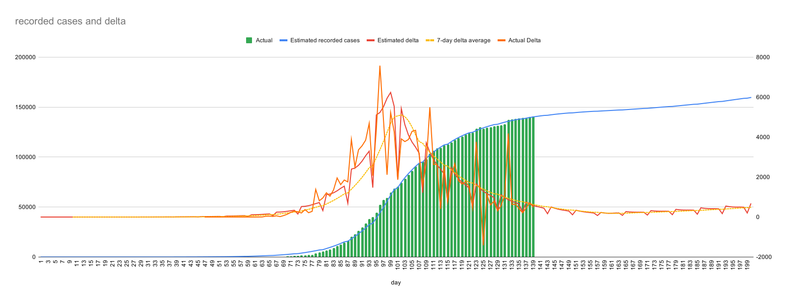

A quick perl script to play with Covid numbers

The perl script is current setup to play with the French reported numbers from http://www.data.gouv.fr/

The core of the script simply runs accross each day using an adjusted gaussian distribution to model reported cases.
Each case generates new cases at the R0 value, but distributed with a mean and variance accross the days. 

These mean and variance numbers have a HUGE impact on the results. For now I have set them as mean 4 (based on the most infective day being reported as 1 day before symptoms start, and symptoms most frequently start on day 5).

10% of Cases are then finally recorded (which seems to be what has been reported), about 25 days after infection (this is established from the French data).

Cases are under-reported during weekends.

Hence the 3 factors that are 'adjutable' are the R0 before "lockdown", during "lockdown", and the number of initial cases entering the country. (The post-lockdown figgure is currently not relevant as of the 15th May).

A modified simulated annealing approach is then used to find the best match using these 2 variables.

The result shows a relatively close match to the actual data.

Of note - this analysis estimates an R0 prior to lockdown of around 1.8, but a inflow of arround 14 people a day during the initial phases (e.g. starting at the end of December 2019, as reported by the French press).

* R0 = 1.83510069563299,
* R0 lockdown = 0.733478820021408
* Imported cases per day = 13.511478613536

This perl script requires nothing much to run it (appart from perl) - but probably does require that you edit the script to do anything interesting.
