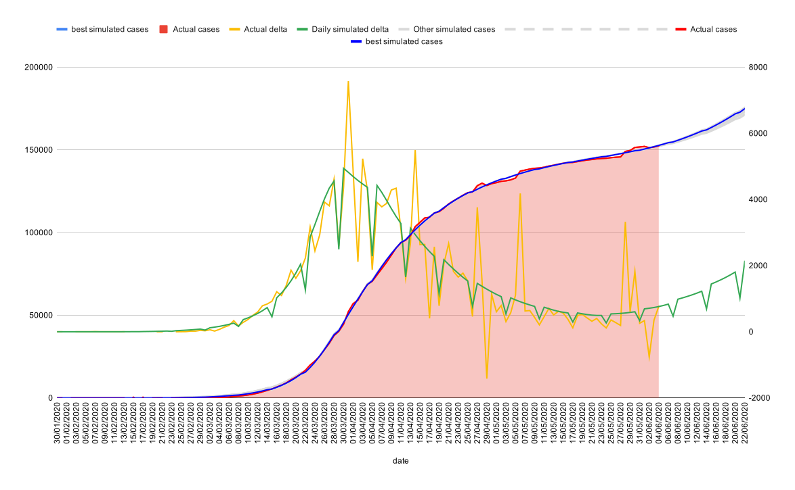

A quick perl script to play with Covid numbers

The perl script is current setup to play with the French reported numbers from e.g. http://www.data.gouv.fr/
Numbers for France and UK are provided.

The script also takes into account mobility data as supplied by Google https://www.gstatic.com/covid19/mobility/Global_Mobility_Report.csv

The core of the script simply runs accross each day using an adjusted gaussian distribution to model reported cases.
Each case generates new cases at the R0 value, but distributed with a mean and variance accross the days. 

These mean and variance numbers have a HUGE impact on the results. 

10% of Cases are then finally recorded (which seems to be what has been reported), some days after infection.

Cases are under-reported during weekends.

Hence the factors that are 'adjutable' are

- Base R0 for virus,
- Mobility multiply,
  - By how much to adjust the moblity data to effect R0.
- Daily Imported cases,
  - (starts the epidemic)
- Infectious day mean,
  - Day on which a patient is most infections
- Infectious day variance,
- Case reporting delay mean,
  - Day on which a case is most likely reported
- Case reporting delay variance,
- Social Distancing effect,
  - Effect on R0 of social distancing etc.
- Start day

A modified simulated annealing approach is then used to find the best match using these variables.

The result shows a relatively close match to the actual data.



This perl script requires nothing much to run it (appart from perl) - but probably does require that you edit the script to do anything interesting. (It is currently set up to run efficiently on 8 cores, your milage will vary).
The script can be run in a few ways:
1. To find the best fit, simply run the script and wait ( a long time ) selecting the country you wish. This will use the supplied data for that country in mobility-<country>.csv and <country>.csv
```bash
  > ./covid.pl france
```
The final output will provide the besst guess factors to use to generate a plot of the epidemic
  
2. To generate a csv file suitable for import into a spreadsheet for a specific set of numbers, run it thus:
```bash
  > ./covid.pl france 1.62331665633201 1.22322391786631 14.8508101367154 3.35628100970738 3.81210295741958 13.7964106893884 3.60087025731919 0.980875807161359 23.6918429689992 > numbers-fr.csv
```

3. To restart the annealing process you can add the '-c' flag, e.g.:
```bash
  > ./covid.pl france -c 1.62331665633201 1.22322391786631 14.8508101367154 3.35628100970738 3.81210295741958 13.7964106893884 3.60087025731919 0.980875807161359 23.6918429689992 > numbers-fr.csv
```
This can be helpful to start the process from a reasonabl position, given new data.


